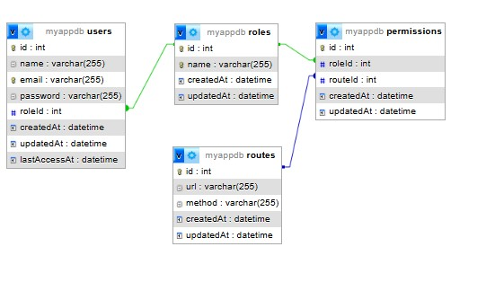
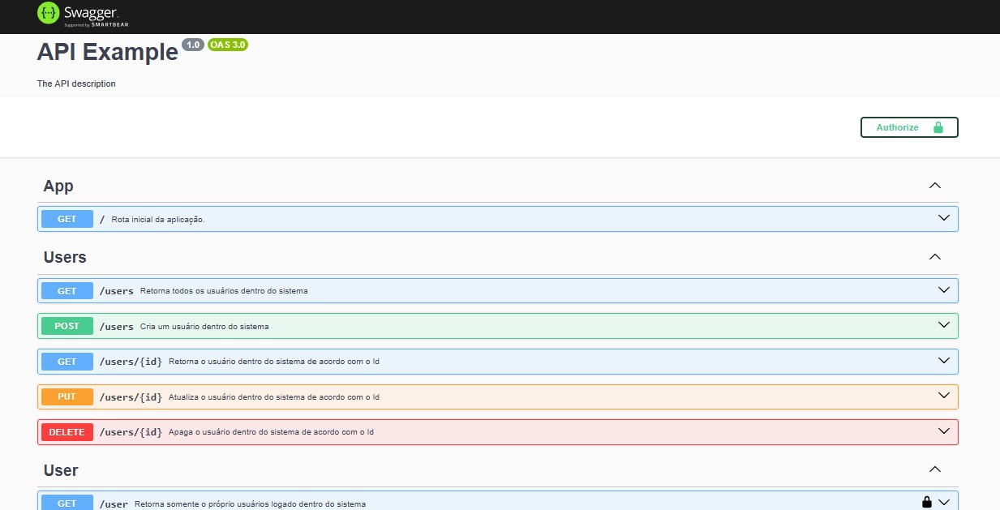
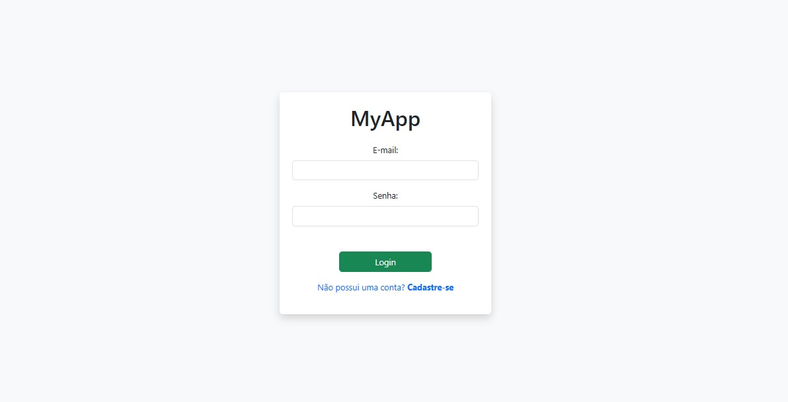
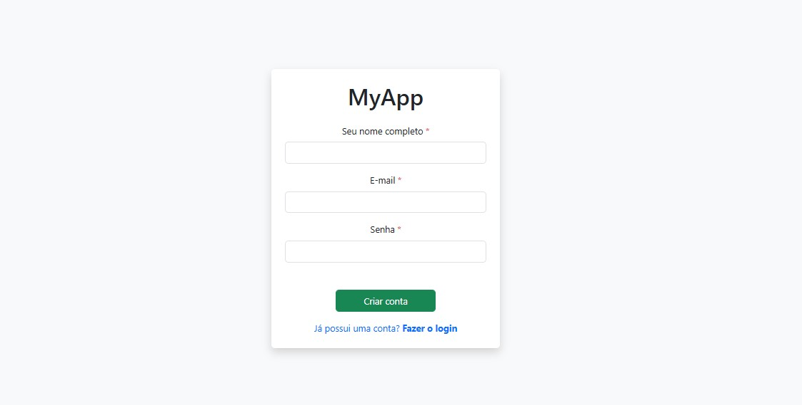
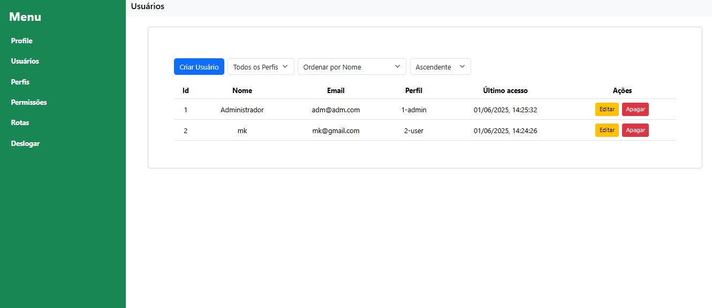

# Manager Users

## Descrição do Projeto

O **Manager Users** é uma API desenvolvida em NestJS para gerenciamento de usuários, papéis (roles), permissões e rotas protegidas. O sistema permite autenticação JWT, controle de acesso baseado em permissões e organização modular para fácil manutenção e expansão.

---

## Tecnologias Utilizadas - BackEnd

- **Node.js** (runtime)
- **NestJS** (framework principal)
- **Sequelize** (ORM)
- **MySQL** (banco de dados relacional)
- **JWT** (autenticação)
- **Passport** (autenticação)
- **Docker** e **Docker Compose** (ambiente de desenvolvimento)
- **Jest** (testes automatizados)
- **Swagger** (documentação automática da API)

---

## Organização no Banco de Dados

O banco de dados é estruturado com as seguintes tabelas principais:

- **users**: Armazena os usuários do sistema.
- **roles**: Define os papéis (ex: admin, user).
- **permissions**: Relaciona roles e rotas, controlando o acesso.
- **routes**: Guarda as rotas registradas na aplicação.
- **(Relacionamentos)**:  
  - Um usuário pertence a um role.
  - Um role pode ter várias permissões para diferentes rotas.

---

## Instalação

### Pré-requisitos

- [Node.js](https://nodejs.org/)
- [Docker](https://www.docker.com/) e [Docker Compose](https://docs.docker.com/compose/)
- [MySQL](https://www.mysql.com/) (caso não use Docker)

### Passos

1. **Clone o repositório:**
   ```bash
   git clone <url-do-repositorio>
   cd manager_users
   ```

### Como instalar o Docker e rodar o projeto

#### 1. Instale o Docker e o Docker Compose

- **Linux (Ubuntu/Debian):**
  ```bash
  sudo apt update
  sudo apt install -y docker.io docker-compose
  sudo systemctl enable --now docker
  sudo usermod -aG docker $USER
  # Faça logout e login novamente para aplicar o grupo
  ```

#### 2. Rode o projeto com Docker Compose

No diretório raiz do projeto, execute:

```bash
docker-compose up --build
```

---

## Portas de Trabalho dos Serviços

- **Frontend (React):**  
  - Porta **3003**  
  - Acessível em: [http://localhost:3003](http://localhost:3003)

- **Backend (NestJS):**  
  - Porta **3000**  
  - Acessível em: [http://localhost:3000](http://localhost:3000)
  - Documentação Swagger: [http://localhost:3000/api](http://localhost:3000/api)

- **Banco de Dados MySQL:**  
  - Porta **3306**  
  - Usada internamente pelos containers e disponível para conexão local, se necessário.

- **phpMyAdmin:**  
  - Porta **8080**  
  - Interface web para gerenciar o banco de dados: [http://localhost:8080](http://localhost:8080)
  - **Credenciais para acessar o banco de dados estão no .env**


## Estrutura do Banco de Dados e Relacionamentos

O banco de dados do Manager Users é relacional (MySQL) e possui as seguintes tabelas principais:

### Tabelas

- **users**
  - id (PK) - name - email - password - roleId (FK para roles) - createdAt - updatedAt - lastAccessAt

- **roles**
  - id (PK) - name - createdAt - updatedAt

- **routes**
  - id (PK) - url - method - createdAt - updatedAt

- **permissions**
  - id (PK) - roleId (FK para roles) - routeId (FK para routes) - createdAt - updatedAt

### Relacionamentos

- **Um usuário pertence a um role:**  
  Cada registro em `users` possui um campo `roleId` que referencia um registro em `roles`.

- **Um role pode ter várias permissões:**  
  A tabela `permissions` faz a ligação entre `roles` e `routes`, indicando quais roles têm acesso a quais rotas.

- **Uma permissão pertence a um role e a uma rota:**  
  Cada registro em `permissions` possui um `roleId` e um `routeId`, formando a permissão de acesso.

- **Uma rota pode ser associada a várias permissões:**  
  Assim, diferentes roles podem ter acesso à mesma rota, dependendo das permissões cadastradas.

### Resumo Visual




- Um usuário → um role
- Um role → várias permissões
- Uma permissão → um role e uma rota
- Uma rota → várias permissões

Essa estrutura permite um controle flexível e seguro de acesso às rotas da aplicação.

---

## Testes Automatizados

Para rodar os testes automatizados do projeto, utilize o seguinte comando dentro do diretório `backend`:

```bash
npm run test:all
```

## Documentação da API (Swagger)

A documentação interativa da API é gerada automaticamente com o Swagger.

Após subir o backend, acesse:

🔗 **[http://localhost:3000/api](http://localhost:3000/api)**


Na interface do Swagger, você pode:

- 📖 **Visualizar todos os endpoints disponíveis**
- 🧪 **Testar requisições diretamente pelo navegador**
- 📦 **Ver exemplos de payloads e respostas**
- 🔒 **Checar quais rotas exigem autenticação e como enviar o token**

> **Dica:**  
> Sempre consulte o Swagger para entender os parâmetros, formatos de requisição e respostas esperadas da API.  
> O Swagger facilita o desenvolvimento, integração e testes da sua aplicação!


## Tecnologias Utilizadas - FrontEnd

O frontend do projeto foi desenvolvido utilizando as seguintes tecnologias:

- **React**: Biblioteca principal para construção da interface de usuário.
- **TypeScript**: Superset do JavaScript que adiciona tipagem estática ao código, aumentando a robustez e a produtividade.
- **React Router DOM**: Gerenciamento de rotas e navegação entre páginas da aplicação.
- **Axios**: Cliente HTTP para comunicação com a API backend.
- **Bootstrap** e **React-Bootstrap**: Frameworks para estilização e componentes visuais responsivos.
- **React Scripts**: Scripts e configuração padrão para desenvolvimento, build e testes de aplicações React.
- **Web Vitals**: Biblioteca para monitoramento de métricas de performance da aplicação.
- **@types/\***: Tipagens TypeScript para bibliotecas de terceiros, garantindo melhor integração e autocompletar no editor.

Essas tecnologias garantem uma aplicação moderna, responsiva, testável e de fácil manutenção.

---

🔗 **[http://localhost:3003](http://localhost:3003)**





